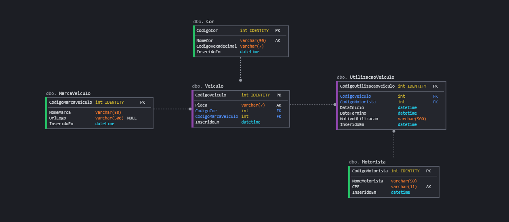

# ** Teste Técnico Prático - SEIDOR **

Objetivo: Construtir uma API que permita controlar a utilização dos automóveis de uma empresa.

---
 

> ## Instalação e Inicialização

1. Instalar as dependencias do npm:

    `npm install`

2. Executar o build do projeto:
  
    `npm run build`

3. Executar as migrations do ORM para criar a estrutura de tabelas e a Carga Inicial no Banco de Dados:

    `npm run typeorm migration:run -- -c dev`

4. Inicializar a API:
    
    `npm run start`

 

> ## Swagger e Documentação
  Para acessar o swagger com a documentação dos endpoints, basta adicionar */api-docs/* após o endereço e porta do API.

  Por padrão o endereço utilizado é o localhost ou 127.0.0.1 e a porta 9001.

  Caso necessario esses valores podem ser alterados.

  Link para o Swagger: [http://127.0.0.1:9001/api-docs](http://127.0.0.1:9001/api-docs)

 

> ## Diagrama do Banco de Dados
* Utilizado o sqlite com persistencia em arquivo .db3 e tambem em modo de armazenamento temporario em memoria (para os testes).

 

> ## Endpoints ref. Automóvel
* Cadastrar um novo automóvel.
* Atualizar um automóvel cadastrado.
* Excluir um automóvel cadastrado.
* Recuperar um automóvel cadastrado pelo seu identificador único.
* Listar os automóveis cadastrados. Deve ser possível filtrar a listagem dos automóveis por cor e marca.

 

> ## Endpoints ref. Motorista
* Cadastrar um novo motorista.
* Atualizar um motorista cadastrado.
* Excluir um motorista cadastrado.
* Recuperar um motorista cadastrado pelo seu identificador único.
* Listar os motoristas cadastrados. Deve ser possível filtrar a listagem dos motoristas por nome.

 

> ## Endpoints ref. Utilização do Automóvel
* Criar um registro que represente a utilização de um automóvel por um motorista, com uma data de início e um texto do motivo de utilização.
* Finalizar a utilização de um automóvel por um motorista guardando a data de finalização.
* Listar os registros de utilização cadastrados no sistema com o nome do motorista e as informações do automóvel utilizado.

 

> ## Regras de Negócio
* Um automóvel só pode ser utilizado por um motorista por vez.
* Um motorista que já esteja utilizando um automóvel não pode utilizar outro automóvel ao mesmo tempo.

 

> ## Bibliotecas e Ferramentas
* NPM
* Typescript
* Git
* Docker
* Jest
* Sqlite
* Swagger
* JsonWebToken
* Faker
* Validator
* Express
* Husky
* Lint Staged
* Eslint
* Standard Javascript Style
* Rimraf
* Module-Alias
* Copyfiles
* Npm Check

* **StandardJS + ESLint**  
      É um guia de estilo (style guides) que define padrões de escrita no código-fonte. É um documento descritivo que vai dizer quais são as regras e padrões a serem seguidos no projeto. Obedecendo convenções de codificação, as quais são diretrizes de estilo para programação.

   - Estas diretrizes normalmente cobrem:
      - Regras de nomenclatura e declaração para variáveis e funções.
      - Regras para o uso de espaço em branco, recuo e comentários.
      - Práticas e princípios de programação.
      
   - Já as convenções de codificação garantem qualidade:
      - Melhorando a legibilidade do código  
      - Facilitando a manutenção do código

* **Husky + Lint-Staged**  
      Ferramentas para automatizar a padronização e qualidade do código-fonte, evitando que sejam realizados commits com estilo de código fora do padrão, sem testes unitários ou com cobertura de testes abaixo de 100%.

 

> ## Autor
* **Lucas Gusmão de Freitas** - Analista de Programação.
